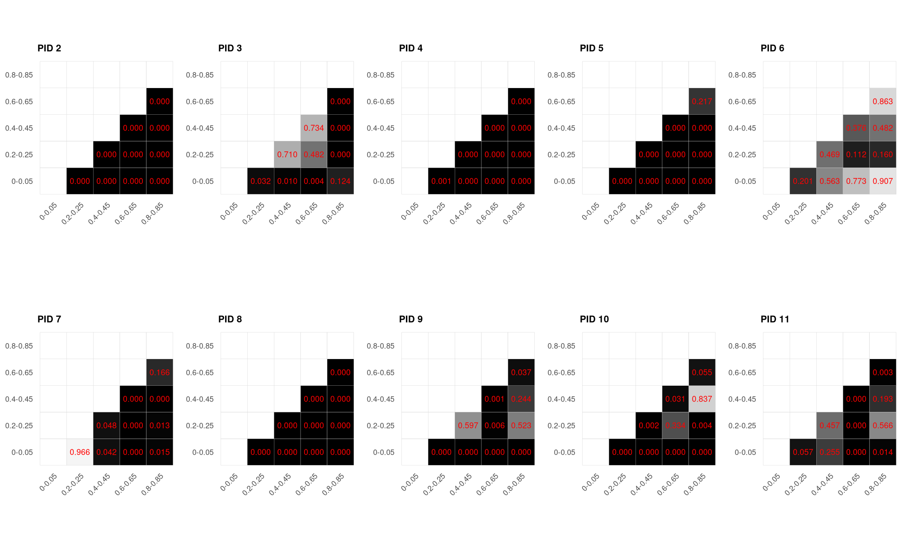
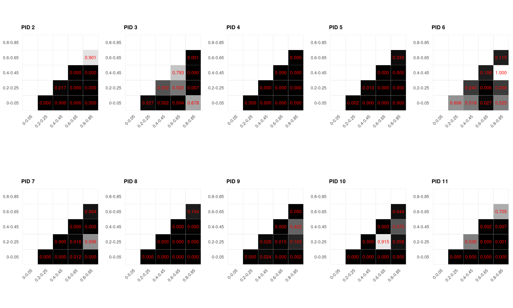
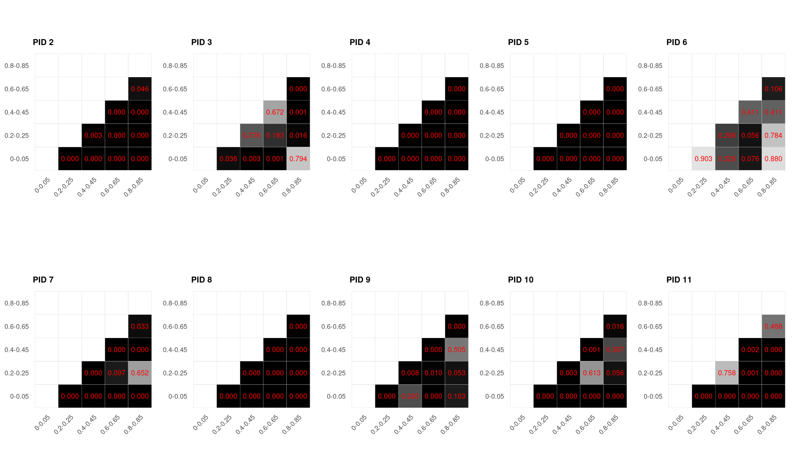
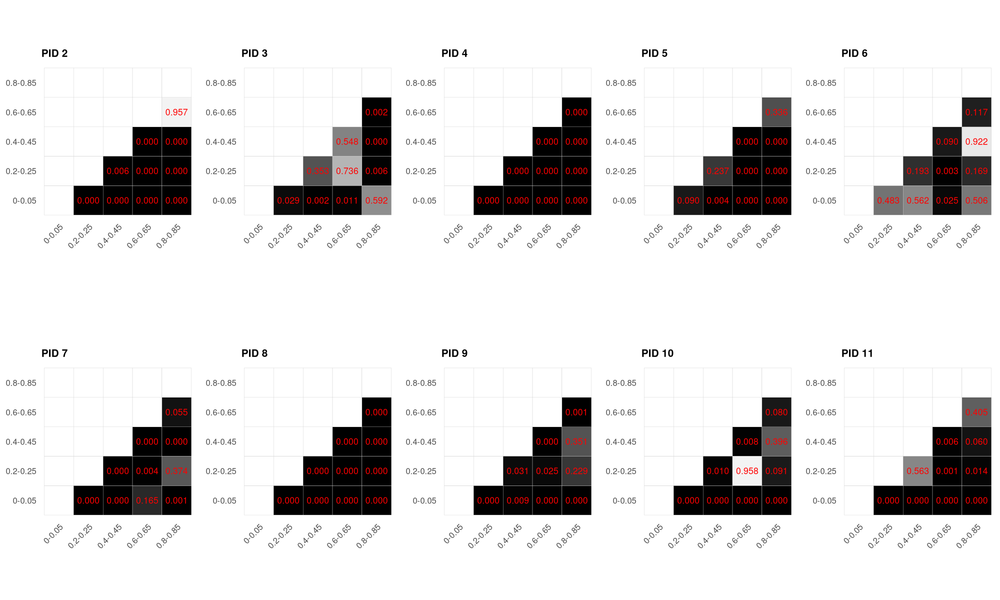
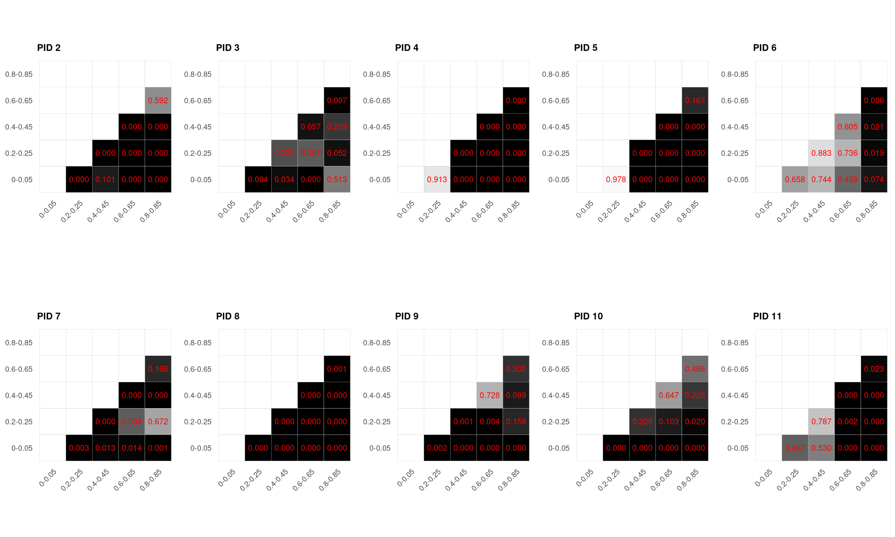
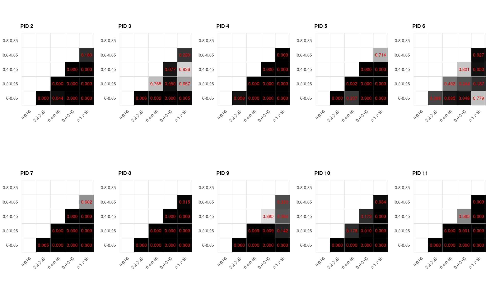
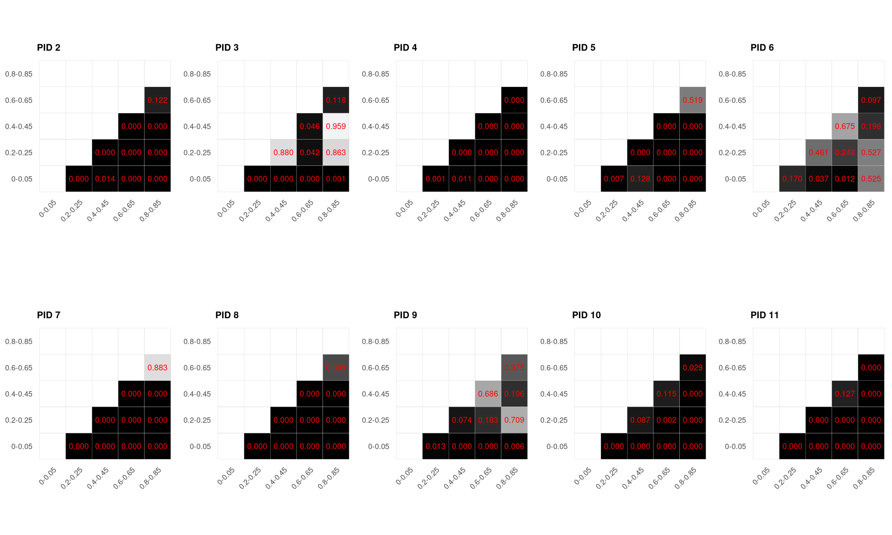
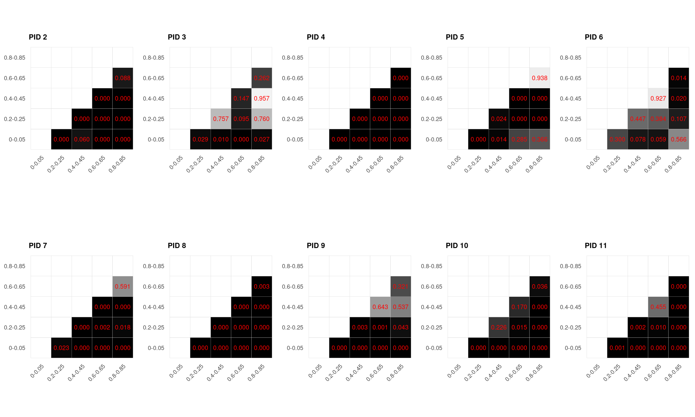

#+title: Comprehensive COG Parameter Evaluation: Multi-Agent Simulation Analysis
#+PROPERTY: header-args:R :exports both :results value :colnames yes :dir . :cache yes :eval never-export
#+STARTUP: hideblocks
#+LATEX_CLASS_OPTIONS: [9pt]
#+LATEX_HEADER: \usepackage[margin=0.5in]{geometry}
#+LATEX_HEADER: \usepackage{longtable}
#+LATEX_HEADER: \usepackage{booktabs}
#+LATEX_HEADER: \usepackage{amssymb, amsmath}
#+author: Research Team
#+date: 2025

* Abstract

This document presents a comprehensive evaluation of cognitive parameter (COG) influence across multi-agent evacuation simulation datasets. We systematically analyze 10 different parameters (PIDs 2-11) and their impact on four key performance metrics: agent time enabled, collision times, distance traveled, and PLE energy consumption. The analysis employs multiple complementary methodologies including sensitivity analysis (t-test based), predictability measurement (regression based), and correlation validation. Results are organized by simulation type (heterogeneous vs homogeneous) to reveal how parameter uniformity affects collective behavior and predictability.

* Introduction

This comprehensive evaluation integrates results from multiple analytical approaches applied to COG (Cognitive Parameter) simulation data. Building upon exploratory analysis and validated through independent statistical methods, this document provides a complete quantitative assessment of parameter influence in multi-agent evacuation scenarios.

** Research Context

The COG simulation framework models pedestrian evacuation scenarios where agents navigate through environments with varying parameter configurations. Understanding which parameters significantly affect outcomes is crucial for:
- Model calibration and validation
- Computational efficiency (parameter reduction)
- Predictive accuracy in evacuation planning
- Understanding emergent collective behavior

** Simulation Types

This evaluation distinguishes between two fundamental experimental conditions:

- **Heterogeneous Simulations**: Each agent has different parameter values for the tested parameter, while all other parameters remain constant across agents. This configuration reveals whether parameter diversity within a population influences outcomes, particularly important for bi-directional interactions where agents with different characteristics encounter each other.

- **Homogeneous Simulations**: All agents in a scenario share identical parameter values. This configuration tests how changing a parameter uniformly across the entire population affects collective behavior and enables clearer detection of parameter effects.

The distinction between these conditions is critical for interpretation. Our analysis reveals that homogeneous populations show dramatically higher predictability (50-80% of parameters at p<0.05) compared to heterogeneous populations (10-20% at p<0.01), with effect sizes differing by an order of magnitude.

** Evaluation Structure

The evaluation is organized into two major sections corresponding to simulation types, each containing four measurement categories:

1. **Heterogeneous Simulations**
   - Collision Times Analysis
   - Energy Consumption Analysis
   - Distance Traveled (Length) Analysis
   - Time Enabled Analysis

2. **Homogeneous Simulations**
   - Collision Times Analysis
   - Energy Consumption Analysis
   - Distance Traveled (Length) Analysis
   - Time Enabled Analysis

Each section integrates three complementary analytical approaches:
- **Sensitivity Analysis**: T-test based pairwise comparisons across parameter ranges
- **Correlation Validation**: Cross-method verification of parameter importance

** Analytical Methodologies

*** Sensitivity Analysis (T-Test Based)

Parameters are divided into 5 discrete ranges (0-0.05, 0.2-0.25, 0.4-0.45, 0.6-0.65, 0.8-0.85), and pairwise Welch's t-tests compare outcomes between ranges. Significance is assessed at multiple thresholds (p < 0.05, p < 0.01, p < 0.005), with the count of significant pairs indicating parameter sensitivity.

**Key Metrics:**
- Significance count: Number of pairwise comparisons with p < threshold
- Distribution visualization: Histograms and heatmaps of p-values
- KDE plots: Kernel density estimation of outcome distributions per range

** Computational Parameters

All analyses use:
- Bootstrap iterations: B = 1000 (where applicable)
- Confidence level: 95%
- Significance thresholds: 0.05, 0.01, 0.005
- Parameter ranges: 5 bins across normalized [0,1] space
- Parallel processing: Utilizing multiple cores for efficiency

* Parameter Descriptions

The following table describes each of the 10 parameters (PIDs 2-11) analyzed in this evaluation. Each parameter represents a key characteristic of pedestrian behavior or physical properties in the simulation model.

| PID | Parameter Key          | Lower Bound | Upper Bound | Description                                                                             |
|-----+------------------------+-------------+-------------+-----------------------------------------------------------------------------------------|
|   2 | cogp_agent_radius      |        0.15 |         0.3 | Physical radius of the pedestrian's body in meters                                      |
|   3 | cogp_mass              |        60.0 |       100.0 | Body mass of the pedestrian in kilograms                                                |
|   4 | cogp_max_speed         |         1.0 |         2.0 | Maximum walking speed in meters per second                                              |
|   5 | cogp_max_force         |         1.0 |         2.0 | Maximum physical force that can be exerted by the pedestrian in Newtons                 |
|   6 | cogp_query_radius      |         0.5 |         1.5 | Radius within which a pedestrian detects and interacts with other pedestrians in meters |
|   7 | cogp_vision_phi        |        0.78 |        2.35 | Angular width of the pedestrian's visual field in radians                               |
|   8 | cogp_vision_tau        |         0.1 |         1.0 | Visual perception reaction time in seconds                                              |
|   9 | cogp_vision_resolution |        10.0 |       100.0 | Number of sampling directions or rays within the visual field                           |
|  10 | cogp_vision_range      |         1.0 |        20.0 | Maximum distance of visual perception in meters                                         |
|  11 | cogp_k                 |      2000.0 |      8000.0 | Repulsion coefficient for physical interactions between pedestrians in Newtons          |

These parameter ranges define the experimental space over which the sensitivity and predictability analyses are performed.

* Heterogeneous Simulations

In heterogeneous simulations, each agent within a scenario has a different value for the parameter being tested, while all other parameters remain constant. This setup reveals whether parameter diversity affects outcomes through agent-agent interactions.

** Collision Times

*** Sensitivity Analysis: Parameter Range Comparisons

#+name: hetero_collision_sensitivity
#+begin_src R
# Load t-test results from production pipeline
library(jsonlite)
library(dplyr)
library(tidyr)

# Load results from cog2-result-db.json (JSONL format - one JSON per line)
results_list <- readLines('cog2-result-db.json') %>%
  lapply(function(line) fromJSON(line))

# Transform all results into a clean data frame with pid, type, category, and t-test results
results_df <- lapply(results_list, function(result) {
  # Extract PID and type from first dataset name (e.g., "cog_3_140_homogeneous")
  dataset_name <- result$datasets[1]
  parts <- strsplit(dataset_name, "_")[[1]]
  pid <- as.numeric(parts[2])
  type <- parts[4]  # "homogeneous" or "heterogeneous"
  
  # Get category
  category <- result$category
  
  # Get t-test results - it's already a data frame
  ttest_results <- result$t_test_results
  
  # Extract p-values and convert to numeric
  pvalues <- as.numeric(ttest_results[["p-value"]])
  
  # Return data frame with metadata and t-test results
  data.frame(
    pid = pid,
    type = type,
    category = category,
    pvalue = pvalues,
    stringsAsFactors = FALSE
  )
}) %>% bind_rows()

# Filter for heterogeneous collision data
filtered_data <- results_df %>%
  filter(type == "heterogeneous", category == "collision")

# Calculate significance counts per PID
significance_counts <- filtered_data %>%
  group_by(pid) %>%
  summarise(
    Significant_Pairs_p005 = sum(pvalue < 0.005, na.rm = TRUE),
    Significant_Pairs_p001 = sum(pvalue < 0.001, na.rm = TRUE),
    Total_Comparisons = n(),
    Mean_PValue = mean(pvalue, na.rm = TRUE)
  ) %>%
  arrange(pid)

# Assert that all PIDs have exactly 10 comparisons
if (any(significance_counts$Total_Comparisons != 10)) {
  stop("Assertion failed: Not all PIDs have exactly 10 comparisons!")
}

# Remove Total_Comparisons column since it's always 10
significance_counts <- significance_counts %>%
  select(-Total_Comparisons)

significance_counts
#+end_#+begin_src 

#+end_src

#+RESULTS[496424678effa4fa8a11e5fab8b3e0def221a4b4]: hetero_collision_sensitivity
| pid | Significant_Pairs_p005 | Significant_Pairs_p001 | Mean_PValue |
|-----+------------------------+------------------------+-------------|
|   2 |                     10 |                     10 |           0 |
|   3 |                      4 |                      3 |      0.2096 |
|   4 |                     10 |                      9 |      0.0001 |
|   5 |                      9 |                      9 |      0.0217 |
|   6 |                      0 |                      0 |      0.4906 |
|   7 |                      4 |                      4 |       0.125 |
|   8 |                     10 |                     10 |           0 |
|   9 |                      5 |                      4 |      0.1408 |
|  10 |                      6 |                      4 |      0.1263 |
|  11 |                      4 |                      3 |      0.1545 |

*** Visualization: P-Value Heatmap

#+name: hetero_collision_heatmap_tables
#+begin_src R :results output
# Load the function
source('pvalue_heatmap.R')

# Load results
library(jsonlite)
results_list <- readLines('cog2-result-db.json') %>%
  lapply(function(line) fromJSON(line))

# Print p-value matrices for all PIDs
for (pid in 2:11) {
  cat("\n=== PID", pid, "- Heterogeneous Collision ===\n\n")
  
  result <- create_pvalue_heatmap(results_list, 
                                  target_pid = pid, 
                                  target_type = "heterogeneous", 
                                  target_category = "collision")
  
  # Print the matrix
  print(result$pvalue_matrix)
  cat("\n")
}
#+end_src

#+RESULTS[b12ab4f8494f0d9954e02dd138aa7616764ee65a]: hetero_collision_heatmap_tables
#+begin_example

=== PID 2 - Heterogeneous Collision ===

         0-0.05 0.2-0.25 0.4-0.45 0.6-0.65 0.8-0.85
0-0.05       NA        0        0        0        0
0.2-0.25     NA       NA        0        0        0
0.4-0.45     NA       NA       NA        0        0
0.6-0.65     NA       NA       NA       NA        0
0.8-0.85     NA       NA       NA       NA       NA

=== PID 3 - Heterogeneous Collision ===

         0-0.05 0.2-0.25 0.4-0.45 0.6-0.65 0.8-0.85
0-0.05       NA    0.032     0.01    0.004    0.124
0.2-0.25     NA       NA     0.71    0.482    0.000
0.4-0.45     NA       NA       NA    0.734    0.000
0.6-0.65     NA       NA       NA       NA    0.000
0.8-0.85     NA       NA       NA       NA       NA

=== PID 4 - Heterogeneous Collision ===

         0-0.05 0.2-0.25 0.4-0.45 0.6-0.65 0.8-0.85
0-0.05       NA    0.001        0        0        0
0.2-0.25     NA       NA        0        0        0
0.4-0.45     NA       NA       NA        0        0
0.6-0.65     NA       NA       NA       NA        0
0.8-0.85     NA       NA       NA       NA       NA

=== PID 5 - Heterogeneous Collision ===

         0-0.05 0.2-0.25 0.4-0.45 0.6-0.65 0.8-0.85
0-0.05       NA        0        0        0    0.000
0.2-0.25     NA       NA        0        0    0.000
0.4-0.45     NA       NA       NA        0    0.000
0.6-0.65     NA       NA       NA       NA    0.217
0.8-0.85     NA       NA       NA       NA       NA

=== PID 6 - Heterogeneous Collision ===

         0-0.05 0.2-0.25 0.4-0.45 0.6-0.65 0.8-0.85
0-0.05       NA    0.201    0.563    0.773    0.907
0.2-0.25     NA       NA    0.469    0.112    0.160
0.4-0.45     NA       NA       NA    0.376    0.482
0.6-0.65     NA       NA       NA       NA    0.863
0.8-0.85     NA       NA       NA       NA       NA

=== PID 7 - Heterogeneous Collision ===

         0-0.05 0.2-0.25 0.4-0.45 0.6-0.65 0.8-0.85
0-0.05       NA    0.966    0.042        0    0.015
0.2-0.25     NA       NA    0.048        0    0.013
0.4-0.45     NA       NA       NA        0    0.000
0.6-0.65     NA       NA       NA       NA    0.166
0.8-0.85     NA       NA       NA       NA       NA

=== PID 8 - Heterogeneous Collision ===

         0-0.05 0.2-0.25 0.4-0.45 0.6-0.65 0.8-0.85
0-0.05       NA        0        0        0        0
0.2-0.25     NA       NA        0        0        0
0.4-0.45     NA       NA       NA        0        0
0.6-0.65     NA       NA       NA       NA        0
0.8-0.85     NA       NA       NA       NA       NA

=== PID 9 - Heterogeneous Collision ===

         0-0.05 0.2-0.25 0.4-0.45 0.6-0.65 0.8-0.85
0-0.05       NA        0    0.000    0.000    0.000
0.2-0.25     NA       NA    0.597    0.006    0.523
0.4-0.45     NA       NA       NA    0.001    0.244
0.6-0.65     NA       NA       NA       NA    0.037
0.8-0.85     NA       NA       NA       NA       NA

=== PID 10 - Heterogeneous Collision ===

         0-0.05 0.2-0.25 0.4-0.45 0.6-0.65 0.8-0.85
0-0.05       NA        0    0.000    0.000    0.000
0.2-0.25     NA       NA    0.002    0.334    0.004
0.4-0.45     NA       NA       NA    0.031    0.837
0.6-0.65     NA       NA       NA       NA    0.055
0.8-0.85     NA       NA       NA       NA       NA

=== PID 11 - Heterogeneous Collision ===

         0-0.05 0.2-0.25 0.4-0.45 0.6-0.65 0.8-0.85
0-0.05       NA    0.057    0.255        0    0.014
0.2-0.25     NA       NA    0.457        0    0.566
0.4-0.45     NA       NA       NA        0    0.193
0.6-0.65     NA       NA       NA       NA    0.003
0.8-0.85     NA       NA       NA       NA       NA

#+end_example

#+name: hetero_collision_heatmap
#+begin_src R :results output graphics file :file outputs/hetero_collision_heatmap.png :width 2000 :height 1200 :res 150
library(ggplot2)
library(gridExtra)

# Load the function
source('pvalue_heatmap.R')

# Load results
library(jsonlite)
results_list <- readLines('cog2-result-db.json') %>%
  lapply(function(line) fromJSON(line))

# Create heatmaps for all PIDs
plot_list <- lapply(2:11, function(pid) {
  result <- create_pvalue_heatmap(results_list, 
                                  target_pid = pid, 
                                  target_type = "heterogeneous", 
                                  target_category = "collision")
  
  # Adjust plot for grid display
  result$plot + 
    labs(title = paste0("PID ", pid)) +
    theme(axis.text.x = element_text(angle = 45, hjust = 1, size = 8),
          axis.text.y = element_text(size = 8),
          plot.title = element_text(face = "bold", size = 10),
          legend.position = "none")
})

# Arrange plots in grid
grid_plot <- grid.arrange(grobs = plot_list, ncol = 5)
#+end_src

#+RESULTS[c40e3e2f9a04113e592ee84bc816407f3b94b118]: hetero_collision_heatmap

** Energy Consumption
*** Sensitivity Analysis: Parameter Range Comparisons

#+name: hetero_energy_sensitivity
#+begin_src R
# Energy metric sensitivity analysis for heterogeneous simulations

library(jsonlite)
library(dplyr)
library(tidyr)

# Load results from cog2-result-db.json (JSONL format - one JSON per line)
results_list <- readLines('cog2-result-db.json') %>%
  lapply(function(line) fromJSON(line))

# Transform all results into a clean data frame with pid, type, category, and t-test results
results_df <- lapply(results_list, function(result) {
  # Extract PID and type from first dataset name (e.g., "cog_3_140_homogeneous")
  dataset_name <- result$datasets[1]
  parts <- strsplit(dataset_name, "_")[[1]]
  pid <- as.numeric(parts[2])
  type <- parts[4]  # "homogeneous" or "heterogeneous"
  
  # Get category
  category <- result$category
  
  # Get t-test results - it's already a data frame
  ttest_results <- result$t_test_results
  
  # Extract p-values and convert to numeric
  pvalues <- as.numeric(ttest_results[["p-value"]])
  
  # Return data frame with metadata and t-test results
  data.frame(
    pid = pid,
    type = type,
    category = category,
    pvalue = pvalues,
    stringsAsFactors = FALSE
  )
}) %>% bind_rows()

# Filter for heterogeneous energy data
filtered_data <- results_df %>%
  filter(type == "heterogeneous", category == "energy")

# Calculate significance counts per PID
significance_counts <- filtered_data %>%
  group_by(pid) %>%
  summarise(
    Significant_Pairs_p005 = sum(pvalue < 0.005, na.rm = TRUE),
    Significant_Pairs_p001 = sum(pvalue < 0.001, na.rm = TRUE),
    Total_Comparisons = n(),
    Mean_PValue = mean(pvalue, na.rm = TRUE)
  ) %>%
  arrange(pid)

# Assert that all PIDs have exactly 10 comparisons
if (any(significance_counts$Total_Comparisons != 10)) {
  stop("Assertion failed: Not all PIDs have exactly 10 comparisons!")
}

# Remove Total_Comparisons column since it's always 10
significance_counts <- significance_counts %>%
  select(-Total_Comparisons)

significance_counts
#+end_src

#+RESULTS[e6814430e14020ed91527cceecd26c5d9e18d595]: hetero_energy_sensitivity
| pid | Significant_Pairs_p005 | Significant_Pairs_p001 | Mean_PValue |
|-----+------------------------+------------------------+-------------|
|   2 |                      8 |                      8 |      0.0918 |
|   3 |                      4 |                      1 |      0.2366 |
|   4 |                     10 |                     10 |           0 |
|   5 |                      8 |                      7 |      0.0048 |
|   6 |                      0 |                      0 |      0.3395 |
|   7 |                      6 |                      6 |      0.0688 |
|   8 |                      9 |                      9 |      0.0104 |
|   9 |                      5 |                      4 |      0.0652 |
|  10 |                      5 |                      4 |      0.1395 |
|  11 |                      7 |                      5 |      0.1251 |

*** Visualization: P-Value Heatmap

#+name: hetero_energy_heatmap_tables
#+begin_src R :results output
# Load the function
source('pvalue_heatmap.R')

# Load results
library(jsonlite)
results_list <- readLines('cog2-result-db.json') %>%
  lapply(function(line) fromJSON(line))

# Print p-value matrices for all PIDs
for (pid in 2:11) {
  cat("\n=== PID", pid, "- Heterogeneous Energy ===\n\n")
  
  result <- create_pvalue_heatmap(results_list, 
                                  target_pid = pid, 
                                  target_type = "heterogeneous", 
                                  target_category = "energy")
  
  # Print the matrix
  print(result$pvalue_matrix)
  cat("\n")
}
#+end_src

#+RESULTS[64e742dc5ed7e94d2a3f78f2b232a3153b5fce78]: hetero_energy_heatmap_tables
#+begin_example

=== PID 2 - Heterogeneous Energy ===

         0-0.05 0.2-0.25 0.4-0.45 0.6-0.65 0.8-0.85
0-0.05       NA        0    0.000        0    0.000
0.2-0.25     NA       NA    0.017        0    0.000
0.4-0.45     NA       NA       NA        0    0.000
0.6-0.65     NA       NA       NA       NA    0.901
0.8-0.85     NA       NA       NA       NA       NA

=== PID 3 - Heterogeneous Energy ===

         0-0.05 0.2-0.25 0.4-0.45 0.6-0.65 0.8-0.85
0-0.05       NA    0.027    0.002    0.004    0.678
0.2-0.25     NA       NA    0.352    0.502    0.007
0.4-0.45     NA       NA       NA    0.793    0.000
0.6-0.65     NA       NA       NA       NA    0.001
0.8-0.85     NA       NA       NA       NA       NA

=== PID 4 - Heterogeneous Energy ===

         0-0.05 0.2-0.25 0.4-0.45 0.6-0.65 0.8-0.85
0-0.05       NA        0        0        0        0
0.2-0.25     NA       NA        0        0        0
0.4-0.45     NA       NA       NA        0        0
0.6-0.65     NA       NA       NA       NA        0
0.8-0.85     NA       NA       NA       NA       NA

=== PID 5 - Heterogeneous Energy ===

         0-0.05 0.2-0.25 0.4-0.45 0.6-0.65 0.8-0.85
0-0.05       NA    0.002    0.000        0    0.000
0.2-0.25     NA       NA    0.013        0    0.000
0.4-0.45     NA       NA       NA        0    0.000
0.6-0.65     NA       NA       NA       NA    0.033
0.8-0.85     NA       NA       NA       NA       NA

=== PID 6 - Heterogeneous Energy ===

         0-0.05 0.2-0.25 0.4-0.45 0.6-0.65 0.8-0.85
0-0.05       NA    0.608    0.518    0.027    0.525
0.2-0.25     NA       NA    0.240    0.006    0.248
0.4-0.45     NA       NA       NA    0.108    1.000
0.6-0.65     NA       NA       NA       NA    0.115
0.8-0.85     NA       NA       NA       NA       NA

=== PID 7 - Heterogeneous Energy ===

         0-0.05 0.2-0.25 0.4-0.45 0.6-0.65 0.8-0.85
0-0.05       NA        0        0    0.012    0.000
0.2-0.25     NA       NA        0    0.016    0.596
0.4-0.45     NA       NA       NA    0.000    0.000
0.6-0.65     NA       NA       NA       NA    0.064
0.8-0.85     NA       NA       NA       NA       NA

=== PID 8 - Heterogeneous Energy ===

         0-0.05 0.2-0.25 0.4-0.45 0.6-0.65 0.8-0.85
0-0.05       NA        0        0        0    0.000
0.2-0.25     NA       NA        0        0    0.000
0.4-0.45     NA       NA       NA        0    0.000
0.6-0.65     NA       NA       NA       NA    0.104
0.8-0.85     NA       NA       NA       NA       NA

=== PID 9 - Heterogeneous Energy ===

         0-0.05 0.2-0.25 0.4-0.45 0.6-0.65 0.8-0.85
0-0.05       NA        0    0.024    0.000    0.002
0.2-0.25     NA       NA    0.026    0.015    0.163
0.4-0.45     NA       NA       NA    0.000    0.422
0.6-0.65     NA       NA       NA       NA    0.000
0.8-0.85     NA       NA       NA       NA       NA

=== PID 10 - Heterogeneous Energy ===

         0-0.05 0.2-0.25 0.4-0.45 0.6-0.65 0.8-0.85
0-0.05       NA        0    0.000    0.000    0.000
0.2-0.25     NA       NA    0.005    0.915    0.058
0.4-0.45     NA       NA       NA    0.003    0.370
0.6-0.65     NA       NA       NA       NA    0.044
0.8-0.85     NA       NA       NA       NA       NA

=== PID 11 - Heterogeneous Energy ===

         0-0.05 0.2-0.25 0.4-0.45 0.6-0.65 0.8-0.85
0-0.05       NA        0    0.000    0.000    0.000
0.2-0.25     NA       NA    0.536    0.000    0.001
0.4-0.45     NA       NA       NA    0.002    0.007
0.6-0.65     NA       NA       NA       NA    0.705
0.8-0.85     NA       NA       NA       NA       NA

#+end_example

#+name: hetero_energy_heatmap
#+begin_src R :results output graphics file :file outputs/hetero_energy_heatmap.png :width 2000 :height 1200 :res 150
library(ggplot2)
library(gridExtra)

# Load the function
source('pvalue_heatmap.R')

# Load results
library(jsonlite)
results_list <- readLines('cog2-result-db.json') %>%
  lapply(function(line) fromJSON(line))

# Create heatmaps for all PIDs
plot_list <- lapply(2:11, function(pid) {
  result <- create_pvalue_heatmap(results_list, 
                                  target_pid = pid, 
                                  target_type = "heterogeneous", 
                                  target_category = "energy")
  
  # Adjust plot for grid display
  result$plot + 
    labs(title = paste0("PID ", pid)) +
    theme(axis.text.x = element_text(angle = 45, hjust = 1, size = 8),
          axis.text.y = element_text(size = 8),
          plot.title = element_text(face = "bold", size = 10),
          legend.position = "none")
})

# Arrange plots in grid
grid_plot <- grid.arrange(grobs = plot_list, ncol = 5)
#+end_src

#+RESULTS[2fc620945a703d715a164429fe8e7ced1e254fc2]: hetero_energy_heatmap

** Distance Traveled (Length)

*** Sensitivity Analysis: Parameter Range Comparisons

#+name: hetero_length_sensitivity
#+begin_src R
# Length metric sensitivity analysis for heterogeneous simulations

library(jsonlite)
library(dplyr)
library(tidyr)

# Load results from cog2-result-db.json (JSONL format - one JSON per line)
results_list <- readLines('cog2-result-db.json') %>%
  lapply(function(line) fromJSON(line))

# Transform all results into a clean data frame with pid, type, category, and t-test results
results_df <- lapply(results_list, function(result) {
  # Extract PID and type from first dataset name (e.g., "cog_3_140_homogeneous")
  dataset_name <- result$datasets[1]
  parts <- strsplit(dataset_name, "_")[[1]]
  pid <- as.numeric(parts[2])
  type <- parts[4]  # "homogeneous" or "heterogeneous"
  
  # Get category
  category <- result$category
  
  # Get t-test results - it's already a data frame
  ttest_results <- result$t_test_results
  
  # Extract p-values and convert to numeric
  pvalues <- as.numeric(ttest_results[["p-value"]])
  
  # Return data frame with metadata and t-test results
  data.frame(
    pid = pid,
    type = type,
    category = category,
    pvalue = pvalues,
    stringsAsFactors = FALSE
  )
}) %>% bind_rows()

# Filter for heterogeneous length data
filtered_data <- results_df %>%
  filter(type == "heterogeneous", category == "length")

# Calculate significance counts per PID
significance_counts <- filtered_data %>%
  group_by(pid) %>%
  summarise(
    Significant_Pairs_p005 = sum(pvalue < 0.005, na.rm = TRUE),
    Significant_Pairs_p001 = sum(pvalue < 0.001, na.rm = TRUE),
    Total_Comparisons = n(),
    Mean_PValue = mean(pvalue, na.rm = TRUE)
  ) %>%
  arrange(pid)

# Assert that all PIDs have exactly 10 comparisons
if (any(significance_counts$Total_Comparisons != 10)) {
  stop("Assertion failed: Not all PIDs have exactly 10 comparisons!")
}

# Remove Total_Comparisons column since it's always 10
significance_counts <- significance_counts %>%
  select(-Total_Comparisons)

significance_counts
#+end_src

#+RESULTS[95246506fd6f576b012d729aeac72c1d10b7a7eb]: hetero_length_sensitivity
| pid | Significant_Pairs_p005 | Significant_Pairs_p001 | Mean_PValue |
|-----+------------------------+------------------------+-------------|
|   2 |                      9 |                      8 |      0.0049 |
|   3 |                      4 |                      1 |      0.2092 |
|   4 |                     10 |                     10 |           0 |
|   5 |                     10 |                     10 |           0 |
|   6 |                      0 |                      0 |      0.4224 |
|   7 |                      7 |                      7 |      0.0782 |
|   8 |                     10 |                     10 |           0 |
|   9 |                      4 |                      4 |      0.1009 |
|  10 |                      6 |                      4 |      0.0996 |
|  11 |                      8 |                      6 |      0.1249 |

*** Visualization: P-Value Heatmap

#+name: hetero_length_heatmap_tables
#+begin_src R :results output
# Load the function
source('pvalue_heatmap.R')

# Load results
library(jsonlite)
results_list <- readLines('cog2-result-db.json') %>%
  lapply(function(line) fromJSON(line))

# Print p-value matrices for all PIDs
for (pid in 2:11) {
  cat("\n=== PID", pid, "- Heterogeneous Length ===\n\n")
  
  result <- create_pvalue_heatmap(results_list, 
                                  target_pid = pid, 
                                  target_type = "heterogeneous", 
                                  target_category = "length")
  
  # Print the matrix
  print(result$pvalue_matrix)
  cat("\n")
}
#+end_src

#+RESULTS[a4d6996125ef9d22d916fb184115be6344a6ef8e]: hetero_length_heatmap_tables
#+begin_example

=== PID 2 - Heterogeneous Length ===

         0-0.05 0.2-0.25 0.4-0.45 0.6-0.65 0.8-0.85
0-0.05       NA        0    0.000        0    0.000
0.2-0.25     NA       NA    0.003        0    0.000
0.4-0.45     NA       NA       NA        0    0.000
0.6-0.65     NA       NA       NA       NA    0.046
0.8-0.85     NA       NA       NA       NA       NA

=== PID 3 - Heterogeneous Length ===

         0-0.05 0.2-0.25 0.4-0.45 0.6-0.65 0.8-0.85
0-0.05       NA    0.036    0.003    0.001    0.794
0.2-0.25     NA       NA    0.376    0.193    0.016
0.4-0.45     NA       NA       NA    0.672    0.001
0.6-0.65     NA       NA       NA       NA    0.000
0.8-0.85     NA       NA       NA       NA       NA

=== PID 4 - Heterogeneous Length ===

         0-0.05 0.2-0.25 0.4-0.45 0.6-0.65 0.8-0.85
0-0.05       NA        0        0        0        0
0.2-0.25     NA       NA        0        0        0
0.4-0.45     NA       NA       NA        0        0
0.6-0.65     NA       NA       NA       NA        0
0.8-0.85     NA       NA       NA       NA       NA

=== PID 5 - Heterogeneous Length ===

         0-0.05 0.2-0.25 0.4-0.45 0.6-0.65 0.8-0.85
0-0.05       NA        0        0        0        0
0.2-0.25     NA       NA        0        0        0
0.4-0.45     NA       NA       NA        0        0
0.6-0.65     NA       NA       NA       NA        0
0.8-0.85     NA       NA       NA       NA       NA

=== PID 6 - Heterogeneous Length ===

         0-0.05 0.2-0.25 0.4-0.45 0.6-0.65 0.8-0.85
0-0.05       NA    0.903    0.329    0.076    0.880
0.2-0.25     NA       NA    0.268    0.056    0.784
0.4-0.45     NA       NA       NA    0.411    0.411
0.6-0.65     NA       NA       NA       NA    0.106
0.8-0.85     NA       NA       NA       NA       NA

=== PID 7 - Heterogeneous Length ===

         0-0.05 0.2-0.25 0.4-0.45 0.6-0.65 0.8-0.85
0-0.05       NA        0        0    0.000    0.000
0.2-0.25     NA       NA        0    0.097    0.652
0.4-0.45     NA       NA       NA    0.000    0.000
0.6-0.65     NA       NA       NA       NA    0.033
0.8-0.85     NA       NA       NA       NA       NA

=== PID 8 - Heterogeneous Length ===

         0-0.05 0.2-0.25 0.4-0.45 0.6-0.65 0.8-0.85
0-0.05       NA        0        0        0        0
0.2-0.25     NA       NA        0        0        0
0.4-0.45     NA       NA       NA        0        0
0.6-0.65     NA       NA       NA       NA        0
0.8-0.85     NA       NA       NA       NA       NA

=== PID 9 - Heterogeneous Length ===

         0-0.05 0.2-0.25 0.4-0.45 0.6-0.65 0.8-0.85
0-0.05       NA        0    0.330     0.00    0.103
0.2-0.25     NA       NA    0.008     0.01    0.053
0.4-0.45     NA       NA       NA     0.00    0.505
0.6-0.65     NA       NA       NA       NA    0.000
0.8-0.85     NA       NA       NA       NA       NA

=== PID 10 - Heterogeneous Length ===

         0-0.05 0.2-0.25 0.4-0.45 0.6-0.65 0.8-0.85
0-0.05       NA        0    0.000    0.000    0.000
0.2-0.25     NA       NA    0.003    0.613    0.056
0.4-0.45     NA       NA       NA    0.001    0.307
0.6-0.65     NA       NA       NA       NA    0.016
0.8-0.85     NA       NA       NA       NA       NA

=== PID 11 - Heterogeneous Length ===

         0-0.05 0.2-0.25 0.4-0.45 0.6-0.65 0.8-0.85
0-0.05       NA        0    0.000    0.000    0.000
0.2-0.25     NA       NA    0.758    0.001    0.000
0.4-0.45     NA       NA       NA    0.002    0.000
0.6-0.65     NA       NA       NA       NA    0.488
0.8-0.85     NA       NA       NA       NA       NA

#+end_example

#+name: hetero_length_heatmap
#+begin_src R :results output graphics file :file outputs/hetero_length_heatmap.png :width 2000 :height 1200 :res 150
library(ggplot2)
library(gridExtra)

# Load the function
source('pvalue_heatmap.R')

# Load results
library(jsonlite)
results_list <- readLines('cog2-result-db.json') %>%
  lapply(function(line) fromJSON(line))

# Create heatmaps for all PIDs
plot_list <- lapply(2:11, function(pid) {
  result <- create_pvalue_heatmap(results_list, 
                                  target_pid = pid, 
                                  target_type = "heterogeneous", 
                                  target_category = "length")
  
  # Adjust plot for grid display
  result$plot + 
    labs(title = paste0("PID ", pid)) +
    theme(axis.text.x = element_text(angle = 45, hjust = 1, size = 8),
          axis.text.y = element_text(size = 8),
          plot.title = element_text(face = "bold", size = 10),
          legend.position = "none")
})

# Arrange plots in grid
grid_plot <- grid.arrange(grobs = plot_list, ncol = 5)
#+end_src

#+RESULTS[95c99f026889d9f564726a35dd770e810749d962]: hetero_length_heatmap

** Time Enabled
*** Sensitivity Analysis: Parameter Range Comparisons

#+name: hetero_time_sensitivity
#+begin_src R
# Time enabled metric sensitivity analysis for heterogeneous simulations

library(jsonlite)
library(dplyr)
library(tidyr)

# Load results from cog2-result-db.json (JSONL format - one JSON per line)
results_list <- readLines('cog2-result-db.json') %>%
  lapply(function(line) fromJSON(line))

# Transform all results into a clean data frame with pid, type, category, and t-test results
results_df <- lapply(results_list, function(result) {
  # Extract PID and type from first dataset name (e.g., "cog_3_140_homogeneous")
  dataset_name <- result$datasets[1]
  parts <- strsplit(dataset_name, "_")[[1]]
  pid <- as.numeric(parts[2])
  type <- parts[4]  # "homogeneous" or "heterogeneous"
  
  # Get category
  category <- result$category
  
  # Get t-test results - it's already a data frame
  ttest_results <- result$t_test_results
  
  # Extract p-values and convert to numeric
  pvalues <- as.numeric(ttest_results[["p-value"]])
  
  # Return data frame with metadata and t-test results
  data.frame(
    pid = pid,
    type = type,
    category = category,
    pvalue = pvalues,
    stringsAsFactors = FALSE
  )
}) %>% bind_rows()

# Filter for heterogeneous time data
filtered_data <- results_df %>%
  filter(type == "heterogeneous", category == "time")

# Calculate significance counts per PID
significance_counts <- filtered_data %>%
  group_by(pid) %>%
  summarise(
    Significant_Pairs_p005 = sum(pvalue < 0.005, na.rm = TRUE),
    Significant_Pairs_p001 = sum(pvalue < 0.001, na.rm = TRUE),
    Total_Comparisons = n(),
    Mean_PValue = mean(pvalue, na.rm = TRUE)
  ) %>%
  arrange(pid)

# Assert that all PIDs have exactly 10 comparisons
if (any(significance_counts$Total_Comparisons != 10)) {
  stop("Assertion failed: Not all PIDs have exactly 10 comparisons!")
}

# Remove Total_Comparisons column since it's always 10
significance_counts <- significance_counts %>%
  select(-Total_Comparisons)

significance_counts
#+end_src

#+RESULTS[254186d3605c0d0948105372fdc2692fc19ff15c]: hetero_time_sensitivity
| pid | Significant_Pairs_p005 | Significant_Pairs_p001 | Mean_PValue |
|-----+------------------------+------------------------+-------------|
|   2 |                      8 |                      8 |      0.0963 |
|   3 |                      3 |                      1 |      0.2279 |
|   4 |                     10 |                     10 |           0 |
|   5 |                      7 |                      6 |      0.0667 |
|   6 |                      1 |                      0 |       0.307 |
|   7 |                      7 |                      5 |      0.0599 |
|   8 |                     10 |                     10 |           0 |
|   9 |                      5 |                      4 |      0.0646 |
|  10 |                      4 |                      4 |      0.1543 |
|  11 |                      5 |                      4 |      0.1049 |

*** Visualization: P-Value Heatmap

#+name: hetero_time_heatmap_tables
#+begin_src R :results output
# Load the function
source('pvalue_heatmap.R')

# Load results
library(jsonlite)
results_list <- readLines('cog2-result-db.json') %>%
  lapply(function(line) fromJSON(line))

# Print p-value matrices for all PIDs
for (pid in 2:11) {
  cat("\n=== PID", pid, "- Heterogeneous Time ===\n\n")
  
  result <- create_pvalue_heatmap(results_list, 
                                  target_pid = pid, 
                                  target_type = "heterogeneous", 
                                  target_category = "time")
  
  # Print the matrix
  print(result$pvalue_matrix)
  cat("\n")
}
#+end_src

#+RESULTS[ba58348bf5585d8b64a8269e94f7f7d368474bba]: hetero_time_heatmap_tables
#+begin_example

=== PID 2 - Heterogeneous Time ===

         0-0.05 0.2-0.25 0.4-0.45 0.6-0.65 0.8-0.85
0-0.05       NA        0    0.000        0    0.000
0.2-0.25     NA       NA    0.006        0    0.000
0.4-0.45     NA       NA       NA        0    0.000
0.6-0.65     NA       NA       NA       NA    0.957
0.8-0.85     NA       NA       NA       NA       NA

=== PID 3 - Heterogeneous Time ===

         0-0.05 0.2-0.25 0.4-0.45 0.6-0.65 0.8-0.85
0-0.05       NA    0.029    0.002    0.011    0.592
0.2-0.25     NA       NA    0.353    0.736    0.006
0.4-0.45     NA       NA       NA    0.548    0.000
0.6-0.65     NA       NA       NA       NA    0.002
0.8-0.85     NA       NA       NA       NA       NA

=== PID 4 - Heterogeneous Time ===

         0-0.05 0.2-0.25 0.4-0.45 0.6-0.65 0.8-0.85
0-0.05       NA        0        0        0        0
0.2-0.25     NA       NA        0        0        0
0.4-0.45     NA       NA       NA        0        0
0.6-0.65     NA       NA       NA       NA        0
0.8-0.85     NA       NA       NA       NA       NA

=== PID 5 - Heterogeneous Time ===

         0-0.05 0.2-0.25 0.4-0.45 0.6-0.65 0.8-0.85
0-0.05       NA     0.09    0.004        0    0.000
0.2-0.25     NA       NA    0.237        0    0.000
0.4-0.45     NA       NA       NA        0    0.000
0.6-0.65     NA       NA       NA       NA    0.336
0.8-0.85     NA       NA       NA       NA       NA

=== PID 6 - Heterogeneous Time ===

         0-0.05 0.2-0.25 0.4-0.45 0.6-0.65 0.8-0.85
0-0.05       NA    0.483    0.562    0.025    0.506
0.2-0.25     NA       NA    0.193    0.003    0.169
0.4-0.45     NA       NA       NA    0.090    0.922
0.6-0.65     NA       NA       NA       NA    0.117
0.8-0.85     NA       NA       NA       NA       NA

=== PID 7 - Heterogeneous Time ===

         0-0.05 0.2-0.25 0.4-0.45 0.6-0.65 0.8-0.85
0-0.05       NA        0        0    0.165    0.001
0.2-0.25     NA       NA        0    0.004    0.374
0.4-0.45     NA       NA       NA    0.000    0.000
0.6-0.65     NA       NA       NA       NA    0.055
0.8-0.85     NA       NA       NA       NA       NA

=== PID 8 - Heterogeneous Time ===

         0-0.05 0.2-0.25 0.4-0.45 0.6-0.65 0.8-0.85
0-0.05       NA        0        0        0        0
0.2-0.25     NA       NA        0        0        0
0.4-0.45     NA       NA       NA        0        0
0.6-0.65     NA       NA       NA       NA        0
0.8-0.85     NA       NA       NA       NA       NA

=== PID 9 - Heterogeneous Time ===

         0-0.05 0.2-0.25 0.4-0.45 0.6-0.65 0.8-0.85
0-0.05       NA        0    0.009    0.000    0.000
0.2-0.25     NA       NA    0.031    0.025    0.229
0.4-0.45     NA       NA       NA    0.000    0.351
0.6-0.65     NA       NA       NA       NA    0.001
0.8-0.85     NA       NA       NA       NA       NA

=== PID 10 - Heterogeneous Time ===

         0-0.05 0.2-0.25 0.4-0.45 0.6-0.65 0.8-0.85
0-0.05       NA        0     0.00    0.000    0.000
0.2-0.25     NA       NA     0.01    0.958    0.091
0.4-0.45     NA       NA       NA    0.008    0.396
0.6-0.65     NA       NA       NA       NA    0.080
0.8-0.85     NA       NA       NA       NA       NA

=== PID 11 - Heterogeneous Time ===

         0-0.05 0.2-0.25 0.4-0.45 0.6-0.65 0.8-0.85
0-0.05       NA        0    0.000    0.000    0.000
0.2-0.25     NA       NA    0.563    0.001    0.014
0.4-0.45     NA       NA       NA    0.006    0.060
0.6-0.65     NA       NA       NA       NA    0.405
0.8-0.85     NA       NA       NA       NA       NA

#+end_example

#+name: hetero_time_heatmap
#+begin_src R :results output graphics file :file outputs/hetero_time_heatmap.png :width 2000 :height 1200 :res 150
library(ggplot2)
library(gridExtra)

# Load the function
source('pvalue_heatmap.R')

# Load results
library(jsonlite)
results_list <- readLines('cog2-result-db.json') %>%
  lapply(function(line) fromJSON(line))

# Create heatmaps for all PIDs
plot_list <- lapply(2:11, function(pid) {
  result <- create_pvalue_heatmap(results_list, 
                                  target_pid = pid, 
                                  target_type = "heterogeneous", 
                                  target_category = "time")
  
  # Adjust plot for grid display
  result$plot + 
    labs(title = paste0("PID ", pid)) +
    theme(axis.text.x = element_text(angle = 45, hjust = 1, size = 8),
          axis.text.y = element_text(size = 8),
          plot.title = element_text(face = "bold", size = 10),
          legend.position = "none")
})

# Arrange plots in grid
grid_plot <- grid.arrange(grobs = plot_list, ncol = 5)
#+end_src

#+RESULTS[dba571ba89a5e92d98c020263b3f9383359f77cd]: hetero_time_heatmap

* Homogeneous Simulations

In homogeneous simulations, all agents within a scenario share identical parameter values for the parameter being tested. This setup enables clearer detection of parameter effects on collective behavior and shows dramatically higher predictability compared to heterogeneous conditions.

** Collision Times

*** Sensitivity Analysis: Parameter Range Comparisons

#+name: homo_collision_sensitivity
#+begin_src R
# Load t-test results for homogeneous collision analysis

library(jsonlite)
library(dplyr)
library(tidyr)

# Load results from cog2-result-db.json (JSONL format - one JSON per line)
results_list <- readLines('cog2-result-db.json') %>%
  lapply(function(line) fromJSON(line))

# Transform all results into a clean data frame with pid, type, category, and t-test results
results_df <- lapply(results_list, function(result) {
  # Extract PID and type from first dataset name (e.g., "cog_3_140_homogeneous")
  dataset_name <- result$datasets[1]
  parts <- strsplit(dataset_name, "_")[[1]]
  pid <- as.numeric(parts[2])
  type <- parts[4]  # "homogeneous" or "heterogeneous"
  
  # Get category
  category <- result$category
  
  # Get t-test results - it's already a data frame
  ttest_results <- result$t_test_results
  
  # Extract p-values and convert to numeric
  pvalues <- as.numeric(ttest_results[["p-value"]])
  
  # Return data frame with metadata and t-test results
  data.frame(
    pid = pid,
    type = type,
    category = category,
    pvalue = pvalues,
    stringsAsFactors = FALSE
  )
}) %>% bind_rows()

# Filter for homogeneous collision data
filtered_data <- results_df %>%
  filter(type == "homogeneous", category == "collision")

# Calculate significance counts per PID
significance_counts <- filtered_data %>%
  group_by(pid) %>%
  summarise(
    Significant_Pairs_p005 = sum(pvalue < 0.005, na.rm = TRUE),
    Significant_Pairs_p001 = sum(pvalue < 0.001, na.rm = TRUE),
    Total_Comparisons = n(),
    Mean_PValue = mean(pvalue, na.rm = TRUE)
  ) %>%
  arrange(pid)

# Assert that all PIDs have exactly 10 comparisons
if (any(significance_counts$Total_Comparisons != 10)) {
  stop("Assertion failed: Not all PIDs have exactly 10 comparisons!")
}

# Remove Total_Comparisons column since it's always 10
significance_counts <- significance_counts %>%
  select(-Total_Comparisons)

significance_counts
#+end_src

#+RESULTS[9680abb1a198e08ef374bd115a0fdc21db92c0d3]: homo_collision_sensitivity
| pid | Significant_Pairs_p005 | Significant_Pairs_p001 | Mean_PValue |
|-----+------------------------+------------------------+-------------|
|   2 |                      8 |                      8 |      0.0693 |
|   3 |                      2 |                      1 |      0.1618 |
|   4 |                      9 |                      9 |      0.0913 |
|   5 |                      8 |                      8 |      0.1145 |
|   6 |                      0 |                      0 |      0.4184 |
|   7 |                      5 |                      3 |      0.1263 |
|   8 |                     10 |                      9 |      0.0001 |
|   9 |                      6 |                      3 |      0.1194 |
|  10 |                      4 |                      4 |      0.1673 |
|  11 |                      6 |                      5 |      0.1749 |

*** Visualization: P-Value Heatmap

#+name: homo_collision_heatmap_tables
#+begin_src R :results output
# Load the function
source('pvalue_heatmap.R')

# Load results
library(jsonlite)
results_list <- readLines('cog2-result-db.json') %>%
  lapply(function(line) fromJSON(line))

# Print p-value matrices for all PIDs
for (pid in 2:11) {
  cat("\n=== PID", pid, "- Homogeneous Collision ===\n\n")
  
  result <- create_pvalue_heatmap(results_list, 
                                  target_pid = pid, 
                                  target_type = "homogeneous", 
                                  target_category = "collision")
  
  # Print the matrix
  print(result$pvalue_matrix)
  cat("\n")
}
#+end_src

#+RESULTS[8d2602d024bbeb8f8847352099f09e678d2cc84f]: homo_collision_heatmap_tables
#+begin_example

=== PID 2 - Homogeneous Collision ===

         0-0.05 0.2-0.25 0.4-0.45 0.6-0.65 0.8-0.85
0-0.05       NA        0    0.101        0    0.000
0.2-0.25     NA       NA    0.000        0    0.000
0.4-0.45     NA       NA       NA        0    0.000
0.6-0.65     NA       NA       NA       NA    0.592
0.8-0.85     NA       NA       NA       NA       NA

=== PID 3 - Homogeneous Collision ===

         0-0.05 0.2-0.25 0.4-0.45 0.6-0.65 0.8-0.85
0-0.05       NA    0.004    0.034    0.000    0.513
0.2-0.25     NA       NA    0.335    0.387    0.052
0.4-0.45     NA       NA       NA    0.057    0.229
0.6-0.65     NA       NA       NA       NA    0.007
0.8-0.85     NA       NA       NA       NA       NA

=== PID 4 - Homogeneous Collision ===

         0-0.05 0.2-0.25 0.4-0.45 0.6-0.65 0.8-0.85
0-0.05       NA    0.913        0        0        0
0.2-0.25     NA       NA        0        0        0
0.4-0.45     NA       NA       NA        0        0
0.6-0.65     NA       NA       NA       NA        0
0.8-0.85     NA       NA       NA       NA       NA

=== PID 5 - Homogeneous Collision ===

         0-0.05 0.2-0.25 0.4-0.45 0.6-0.65 0.8-0.85
0-0.05       NA    0.978        0        0    0.000
0.2-0.25     NA       NA        0        0    0.000
0.4-0.45     NA       NA       NA        0    0.000
0.6-0.65     NA       NA       NA       NA    0.167
0.8-0.85     NA       NA       NA       NA       NA

=== PID 6 - Homogeneous Collision ===

         0-0.05 0.2-0.25 0.4-0.45 0.6-0.65 0.8-0.85
0-0.05       NA    0.658    0.744    0.438    0.074
0.2-0.25     NA       NA    0.883    0.736    0.019
0.4-0.45     NA       NA       NA    0.605    0.021
0.6-0.65     NA       NA       NA       NA    0.006
0.8-0.85     NA       NA       NA       NA       NA

=== PID 7 - Homogeneous Collision ===

         0-0.05 0.2-0.25 0.4-0.45 0.6-0.65 0.8-0.85
0-0.05       NA    0.003    0.013    0.014    0.001
0.2-0.25     NA       NA    0.000    0.394    0.672
0.4-0.45     NA       NA       NA    0.000    0.000
0.6-0.65     NA       NA       NA       NA    0.166
0.8-0.85     NA       NA       NA       NA       NA

=== PID 8 - Homogeneous Collision ===

         0-0.05 0.2-0.25 0.4-0.45 0.6-0.65 0.8-0.85
0-0.05       NA        0        0        0    0.000
0.2-0.25     NA       NA        0        0    0.000
0.4-0.45     NA       NA       NA        0    0.000
0.6-0.65     NA       NA       NA       NA    0.001
0.8-0.85     NA       NA       NA       NA       NA

=== PID 9 - Homogeneous Collision ===

         0-0.05 0.2-0.25 0.4-0.45 0.6-0.65 0.8-0.85
0-0.05       NA    0.002    0.000    0.000    0.000
0.2-0.25     NA       NA    0.001    0.004    0.158
0.4-0.45     NA       NA       NA    0.728    0.099
0.6-0.65     NA       NA       NA       NA    0.202
0.8-0.85     NA       NA       NA       NA       NA

=== PID 10 - Homogeneous Collision ===

         0-0.05 0.2-0.25 0.4-0.45 0.6-0.65 0.8-0.85
0-0.05       NA        0    0.000    0.000    0.000
0.2-0.25     NA       NA    0.209    0.103    0.020
0.4-0.45     NA       NA       NA    0.647    0.226
0.6-0.65     NA       NA       NA       NA    0.468
0.8-0.85     NA       NA       NA       NA       NA

=== PID 11 - Homogeneous Collision ===

         0-0.05 0.2-0.25 0.4-0.45 0.6-0.65 0.8-0.85
0-0.05       NA    0.407    0.530    0.000    0.000
0.2-0.25     NA       NA    0.787    0.002    0.000
0.4-0.45     NA       NA       NA    0.000    0.000
0.6-0.65     NA       NA       NA       NA    0.023
0.8-0.85     NA       NA       NA       NA       NA

#+end_example

#+name: homo_collision_heatmap
#+begin_src R :results output graphics file :file outputs/homo_collision_heatmap.png :width 2000 :height 1200 :res 150
library(ggplot2)
library(gridExtra)

# Load the function
source('pvalue_heatmap.R')

# Load results
library(jsonlite)
results_list <- readLines('cog2-result-db.json') %>%
  lapply(function(line) fromJSON(line))

# Create heatmaps for all PIDs
plot_list <- lapply(2:11, function(pid) {
  result <- create_pvalue_heatmap(results_list, 
                                  target_pid = pid, 
                                  target_type = "homogeneous", 
                                  target_category = "collision")
  
  # Adjust plot for grid display
  result$plot + 
    labs(title = paste0("PID ", pid)) +
    theme(axis.text.x = element_text(angle = 45, hjust = 1, size = 8),
          axis.text.y = element_text(size = 8),
          plot.title = element_text(face = "bold", size = 10),
          legend.position = "none")
})

# Arrange plots in grid
grid_plot <- grid.arrange(grobs = plot_list, ncol = 5)
#+end_src

#+RESULTS[034df2615d1c5cefeced9773e4f0da982176a4ed]: homo_collision_heatmap

** Energy Consumption

*** Sensitivity Analysis: Parameter Range Comparisons

#+name: homo_energy_sensitivity
#+begin_src R
# Energy sensitivity for homogeneous simulations
# Expected: mean=3.33 significant pairs at p<0.005

library(jsonlite)
library(dplyr)
library(tidyr)

# Load results from cog2-result-db.json (JSONL format - one JSON per line)
results_list <- readLines('cog2-result-db.json') %>%
  lapply(function(line) fromJSON(line))

# Transform all results into a clean data frame with pid, type, category, and t-test results
results_df <- lapply(results_list, function(result) {
  # Extract PID and type from first dataset name (e.g., "cog_3_140_homogeneous")
  dataset_name <- result$datasets[1]
  parts <- strsplit(dataset_name, "_")[[1]]
  pid <- as.numeric(parts[2])
  type <- parts[4]  # "homogeneous" or "heterogeneous"
  
  # Get category
  category <- result$category
  
  # Get t-test results - it's already a data frame
  ttest_results <- result$t_test_results
  
  # Extract p-values and convert to numeric
  pvalues <- as.numeric(ttest_results[["p-value"]])
  
  # Return data frame with metadata and t-test results
  data.frame(
    pid = pid,
    type = type,
    category = category,
    pvalue = pvalues,
    stringsAsFactors = FALSE
  )
}) %>% bind_rows()

# Filter for homogeneous energy data
filtered_data <- results_df %>%
  filter(type == "homogeneous", category == "energy")

# Calculate significance counts per PID
significance_counts <- filtered_data %>%
  group_by(pid) %>%
  summarise(
    Significant_Pairs_p005 = sum(pvalue < 0.005, na.rm = TRUE),
    Significant_Pairs_p001 = sum(pvalue < 0.001, na.rm = TRUE),
    Total_Comparisons = n(),
    Mean_PValue = mean(pvalue, na.rm = TRUE)
  ) %>%
  arrange(pid)

# Assert that all PIDs have exactly 10 comparisons
if (any(significance_counts$Total_Comparisons != 10)) {
  stop("Assertion failed: Not all PIDs have exactly 10 comparisons!")
}

# Remove Total_Comparisons column since it's always 10
significance_counts <- significance_counts %>%
  select(-Total_Comparisons)

significance_counts
#+end_src

#+RESULTS[6f08c9c117a35b12cf05989bacb906f49d52d805]: homo_energy_sensitivity
| pid | Significant_Pairs_p005 | Significant_Pairs_p001 | Mean_PValue |
|-----+------------------------+------------------------+-------------|
|   2 |                      8 |                      8 |      0.0224 |
|   3 |                      2 |                      1 |      0.2618 |
|   4 |                      9 |                      9 |      0.0058 |
|   5 |                      8 |                      7 |      0.0953 |
|   6 |                      0 |                      0 |      0.3101 |
|   7 |                      8 |                      8 |      0.0607 |
|   8 |                      9 |                      9 |      0.0015 |
|   9 |                      4 |                      4 |      0.1729 |
|  10 |                      6 |                      6 |      0.0395 |
|  11 |                      9 |                      8 |      0.0566 |

*** Visualization: P-Value Heatmap

#+name: homo_energy_heatmap_tables
#+begin_src R :results output
# Load the function
source('pvalue_heatmap.R')

# Load results
library(jsonlite)
results_list <- readLines('cog2-result-db.json') %>%
  lapply(function(line) fromJSON(line))

# Print p-value matrices for all PIDs
for (pid in 2:11) {
  cat("\n=== PID", pid, "- Homogeneous Energy ===\n\n")
  
  result <- create_pvalue_heatmap(results_list, 
                                  target_pid = pid, 
                                  target_type = "homogeneous", 
                                  target_category = "energy")
  
  # Print the matrix
  print(result$pvalue_matrix)
  cat("\n")
}
#+end_src

#+RESULTS[b8ba0deac660f496e475321320ad0324b0e45c74]: homo_energy_heatmap_tables
#+begin_example

=== PID 2 - Homogeneous Energy ===

         0-0.05 0.2-0.25 0.4-0.45 0.6-0.65 0.8-0.85
0-0.05       NA        0    0.044        0     0.00
0.2-0.25     NA       NA    0.000        0     0.00
0.4-0.45     NA       NA       NA        0     0.00
0.6-0.65     NA       NA       NA       NA     0.18
0.8-0.85     NA       NA       NA       NA       NA

=== PID 3 - Homogeneous Energy ===

         0-0.05 0.2-0.25 0.4-0.45 0.6-0.65 0.8-0.85
0-0.05       NA    0.006    0.002    0.000    0.005
0.2-0.25     NA       NA    0.765    0.050    0.657
0.4-0.45     NA       NA       NA    0.077    0.836
0.6-0.65     NA       NA       NA       NA    0.220
0.8-0.85     NA       NA       NA       NA       NA

=== PID 4 - Homogeneous Energy ===

         0-0.05 0.2-0.25 0.4-0.45 0.6-0.65 0.8-0.85
0-0.05       NA    0.058        0        0        0
0.2-0.25     NA       NA        0        0        0
0.4-0.45     NA       NA       NA        0        0
0.6-0.65     NA       NA       NA       NA        0
0.8-0.85     NA       NA       NA       NA       NA

=== PID 5 - Homogeneous Energy ===

         0-0.05 0.2-0.25 0.4-0.45 0.6-0.65 0.8-0.85
0-0.05       NA        0    0.237        0    0.000
0.2-0.25     NA       NA    0.002        0    0.000
0.4-0.45     NA       NA       NA        0    0.000
0.6-0.65     NA       NA       NA       NA    0.714
0.8-0.85     NA       NA       NA       NA       NA

=== PID 6 - Homogeneous Energy ===

         0-0.05 0.2-0.25 0.4-0.45 0.6-0.65 0.8-0.85
0-0.05       NA    0.288    0.085    0.048    0.779
0.2-0.25     NA       NA    0.492    0.344    0.187
0.4-0.45     NA       NA       NA    0.801    0.050
0.6-0.65     NA       NA       NA       NA    0.027
0.8-0.85     NA       NA       NA       NA       NA

=== PID 7 - Homogeneous Energy ===

         0-0.05 0.2-0.25 0.4-0.45 0.6-0.65 0.8-0.85
0-0.05       NA    0.005        0        0    0.000
0.2-0.25     NA       NA        0        0    0.000
0.4-0.45     NA       NA       NA        0    0.000
0.6-0.65     NA       NA       NA       NA    0.602
0.8-0.85     NA       NA       NA       NA       NA

=== PID 8 - Homogeneous Energy ===

         0-0.05 0.2-0.25 0.4-0.45 0.6-0.65 0.8-0.85
0-0.05       NA        0        0        0    0.000
0.2-0.25     NA       NA        0        0    0.000
0.4-0.45     NA       NA       NA        0    0.000
0.6-0.65     NA       NA       NA       NA    0.015
0.8-0.85     NA       NA       NA       NA       NA

=== PID 9 - Homogeneous Energy ===

         0-0.05 0.2-0.25 0.4-0.45 0.6-0.65 0.8-0.85
0-0.05       NA        0    0.000    0.000    0.000
0.2-0.25     NA       NA    0.009    0.009    0.142
0.4-0.45     NA       NA       NA    0.885    0.364
0.6-0.65     NA       NA       NA       NA    0.320
0.8-0.85     NA       NA       NA       NA       NA

=== PID 10 - Homogeneous Energy ===

         0-0.05 0.2-0.25 0.4-0.45 0.6-0.65 0.8-0.85
0-0.05       NA        0    0.000    0.000    0.000
0.2-0.25     NA       NA    0.178    0.010    0.000
0.4-0.45     NA       NA       NA    0.173    0.000
0.6-0.65     NA       NA       NA       NA    0.034
0.8-0.85     NA       NA       NA       NA       NA

=== PID 11 - Homogeneous Energy ===

         0-0.05 0.2-0.25 0.4-0.45 0.6-0.65 0.8-0.85
0-0.05       NA        0        0    0.000        0
0.2-0.25     NA       NA        0    0.001        0
0.4-0.45     NA       NA       NA    0.565        0
0.6-0.65     NA       NA       NA       NA        0
0.8-0.85     NA       NA       NA       NA       NA

#+end_example

#+name: homo_energy_heatmap
#+begin_src R :results output graphics file :file outputs/homo_energy_heatmap.png :width 2000 :height 1200 :res 150
library(ggplot2)
library(gridExtra)

# Load the function
source('pvalue_heatmap.R')

# Load results
library(jsonlite)
results_list <- readLines('cog2-result-db.json') %>%
  lapply(function(line) fromJSON(line))

# Create heatmaps for all PIDs
plot_list <- lapply(2:11, function(pid) {
  result <- create_pvalue_heatmap(results_list, 
                                  target_pid = pid, 
                                  target_type = "homogeneous", 
                                  target_category = "energy")
  
  # Adjust plot for grid display
  result$plot + 
    labs(title = paste0("PID ", pid)) +
    theme(axis.text.x = element_text(angle = 45, hjust = 1, size = 8),
          axis.text.y = element_text(size = 8),
          plot.title = element_text(face = "bold", size = 10),
          legend.position = "none")
})

# Arrange plots in grid
grid_plot <- grid.arrange(grobs = plot_list, ncol = 5)
#+end_src

#+RESULTS[f6c05c5a38f6c6138ac04e5400b55330118fc0a6]: homo_energy_heatmap

** Distance Traveled (Length)

*** Sensitivity Analysis: Parameter Range Comparisons

#+name: homo_length_sensitivity
#+begin_src R
# Length sensitivity for homogeneous simulations
# Expected: HIGHEST sensitivity - mean=4.22 significant pairs at p<0.005

library(jsonlite)
library(dplyr)
library(tidyr)

# Load results from cog2-result-db.json (JSONL format - one JSON per line)
results_list <- readLines('cog2-result-db.json') %>%
  lapply(function(line) fromJSON(line))

# Transform all results into a clean data frame with pid, type, category, and t-test results
results_df <- lapply(results_list, function(result) {
  # Extract PID and type from first dataset name (e.g., "cog_3_140_homogeneous")
  dataset_name <- result$datasets[1]
  parts <- strsplit(dataset_name, "_")[[1]]
  pid <- as.numeric(parts[2])
  type <- parts[4]  # "homogeneous" or "heterogeneous"
  
  # Get category
  category <- result$category
  
  # Get t-test results - it's already a data frame
  ttest_results <- result$t_test_results
  
  # Extract p-values and convert to numeric
  pvalues <- as.numeric(ttest_results[["p-value"]])
  
  # Return data frame with metadata and t-test results
  data.frame(
    pid = pid,
    type = type,
    category = category,
    pvalue = pvalues,
    stringsAsFactors = FALSE
  )
}) %>% bind_rows()

# Filter for homogeneous length data
filtered_data <- results_df %>%
  filter(type == "homogeneous", category == "length")

# Calculate significance counts per PID
significance_counts <- filtered_data %>%
  group_by(pid) %>%
  summarise(
    Significant_Pairs_p005 = sum(pvalue < 0.005, na.rm = TRUE),
    Significant_Pairs_p001 = sum(pvalue < 0.001, na.rm = TRUE),
    Total_Comparisons = n(),
    Mean_PValue = mean(pvalue, na.rm = TRUE)
  ) %>%
  arrange(pid)

# Assert that all PIDs have exactly 10 comparisons
if (any(significance_counts$Total_Comparisons != 10)) {
  stop("Assertion failed: Not all PIDs have exactly 10 comparisons!")
}

# Remove Total_Comparisons column since it's always 10
significance_counts <- significance_counts %>%
  select(-Total_Comparisons)

significance_counts
#+end_src

#+RESULTS[b6853a0e84c18dd8efdad85e05c5b51c43d5a241]: homo_length_sensitivity
| pid | Significant_Pairs_p005 | Significant_Pairs_p001 | Mean_PValue |
|-----+------------------------+------------------------+-------------|
|   2 |                      8 |                      8 |      0.0136 |
|   3 |                      4 |                      3 |      0.2909 |
|   4 |                      9 |                      8 |      0.0012 |
|   5 |                      7 |                      7 |      0.0654 |
|   6 |                      0 |                      0 |      0.2948 |
|   7 |                      9 |                      9 |      0.0883 |
|   8 |                      9 |                      9 |      0.0309 |
|   9 |                      2 |                      2 |      0.2242 |
|  10 |                      7 |                      6 |      0.0233 |
|  11 |                      9 |                      9 |      0.0127 |

*** Visualization: P-Value Heatmap

#+name: homo_length_heatmap_tables
#+begin_src R :results output
# Load the function
source('pvalue_heatmap.R')

# Load results
library(jsonlite)
results_list <- readLines('cog2-result-db.json') %>%
  lapply(function(line) fromJSON(line))

# Print p-value matrices for all PIDs
for (pid in 2:11) {
  cat("\n=== PID", pid, "- Homogeneous Length ===\n\n")
  
  result <- create_pvalue_heatmap(results_list, 
                                  target_pid = pid, 
                                  target_type = "homogeneous", 
                                  target_category = "length")
  
  # Print the matrix
  print(result$pvalue_matrix)
  cat("\n")
}
#+end_src

#+RESULTS[bdae9823bdcea698ae8d6f51c555b7ee42a33ca6]: homo_length_heatmap_tables
#+begin_example

=== PID 2 - Homogeneous Length ===

         0-0.05 0.2-0.25 0.4-0.45 0.6-0.65 0.8-0.85
0-0.05       NA        0    0.014        0    0.000
0.2-0.25     NA       NA    0.000        0    0.000
0.4-0.45     NA       NA       NA        0    0.000
0.6-0.65     NA       NA       NA       NA    0.122
0.8-0.85     NA       NA       NA       NA       NA

=== PID 3 - Homogeneous Length ===

         0-0.05 0.2-0.25 0.4-0.45 0.6-0.65 0.8-0.85
0-0.05       NA        0     0.00    0.000    0.001
0.2-0.25     NA       NA     0.88    0.042    0.863
0.4-0.45     NA       NA       NA    0.046    0.959
0.6-0.65     NA       NA       NA       NA    0.118
0.8-0.85     NA       NA       NA       NA       NA

=== PID 4 - Homogeneous Length ===

         0-0.05 0.2-0.25 0.4-0.45 0.6-0.65 0.8-0.85
0-0.05       NA    0.001    0.011        0        0
0.2-0.25     NA       NA    0.000        0        0
0.4-0.45     NA       NA       NA        0        0
0.6-0.65     NA       NA       NA       NA        0
0.8-0.85     NA       NA       NA       NA       NA

=== PID 5 - Homogeneous Length ===

         0-0.05 0.2-0.25 0.4-0.45 0.6-0.65 0.8-0.85
0-0.05       NA    0.007    0.128        0    0.000
0.2-0.25     NA       NA    0.000        0    0.000
0.4-0.45     NA       NA       NA        0    0.000
0.6-0.65     NA       NA       NA       NA    0.519
0.8-0.85     NA       NA       NA       NA       NA

=== PID 6 - Homogeneous Length ===

         0-0.05 0.2-0.25 0.4-0.45 0.6-0.65 0.8-0.85
0-0.05       NA     0.17    0.037    0.012    0.525
0.2-0.25     NA       NA    0.461    0.248    0.527
0.4-0.45     NA       NA       NA    0.675    0.196
0.6-0.65     NA       NA       NA       NA    0.097
0.8-0.85     NA       NA       NA       NA       NA

=== PID 7 - Homogeneous Length ===

         0-0.05 0.2-0.25 0.4-0.45 0.6-0.65 0.8-0.85
0-0.05       NA        0        0        0    0.000
0.2-0.25     NA       NA        0        0    0.000
0.4-0.45     NA       NA       NA        0    0.000
0.6-0.65     NA       NA       NA       NA    0.883
0.8-0.85     NA       NA       NA       NA       NA

=== PID 8 - Homogeneous Length ===

         0-0.05 0.2-0.25 0.4-0.45 0.6-0.65 0.8-0.85
0-0.05       NA        0        0        0    0.000
0.2-0.25     NA       NA        0        0    0.000
0.4-0.45     NA       NA       NA        0    0.000
0.6-0.65     NA       NA       NA       NA    0.309
0.8-0.85     NA       NA       NA       NA       NA

=== PID 9 - Homogeneous Length ===

         0-0.05 0.2-0.25 0.4-0.45 0.6-0.65 0.8-0.85
0-0.05       NA    0.013    0.000    0.000    0.006
0.2-0.25     NA       NA    0.074    0.183    0.709
0.4-0.45     NA       NA       NA    0.686    0.196
0.6-0.65     NA       NA       NA       NA    0.375
0.8-0.85     NA       NA       NA       NA       NA

=== PID 10 - Homogeneous Length ===

         0-0.05 0.2-0.25 0.4-0.45 0.6-0.65 0.8-0.85
0-0.05       NA        0    0.000    0.000    0.000
0.2-0.25     NA       NA    0.087    0.002    0.000
0.4-0.45     NA       NA       NA    0.115    0.000
0.6-0.65     NA       NA       NA       NA    0.029
0.8-0.85     NA       NA       NA       NA       NA

=== PID 11 - Homogeneous Length ===

         0-0.05 0.2-0.25 0.4-0.45 0.6-0.65 0.8-0.85
0-0.05       NA        0        0    0.000        0
0.2-0.25     NA       NA        0    0.000        0
0.4-0.45     NA       NA       NA    0.127        0
0.6-0.65     NA       NA       NA       NA        0
0.8-0.85     NA       NA       NA       NA       NA

#+end_example

#+name: homo_length_heatmap
#+begin_src R :results output graphics file :file outputs/homo_length_heatmap.png :width 2000 :height 1200 :res 150
library(ggplot2)
library(gridExtra)

# Load the function
source('pvalue_heatmap.R')

# Load results
library(jsonlite)
results_list <- readLines('cog2-result-db.json') %>%
  lapply(function(line) fromJSON(line))

# Create heatmaps for all PIDs
plot_list <- lapply(2:11, function(pid) {
  result <- create_pvalue_heatmap(results_list, 
                                  target_pid = pid, 
                                  target_type = "homogeneous", 
                                  target_category = "length")
  
  # Adjust plot for grid display
  result$plot + 
    labs(title = paste0("PID ", pid)) +
    theme(axis.text.x = element_text(angle = 45, hjust = 1, size = 8),
          axis.text.y = element_text(size = 8),
          plot.title = element_text(face = "bold", size = 10),
          legend.position = "none")
})

# Arrange plots in grid
grid_plot <- grid.arrange(grobs = plot_list, ncol = 5)
#+end_src

#+RESULTS[0a154de758f9959acf41910d789c51244e84c7ae]: homo_length_heatmap

** Time Enabled

*** Sensitivity Analysis: Parameter Range Comparisons

#+name: homo_time_sensitivity
#+begin_src R
# Time enabled sensitivity for homogeneous simulations
# Expected: mean=3.33 significant pairs at p<0.005

library(jsonlite)
library(dplyr)
library(tidyr)

# Load results from cog2-result-db.json (JSONL format - one JSON per line)
results_list <- readLines('cog2-result-db.json') %>%
  lapply(function(line) fromJSON(line))

# Transform all results into a clean data frame with pid, type, category, and t-test results
results_df <- lapply(results_list, function(result) {
  # Extract PID and type from first dataset name (e.g., "cog_3_140_homogeneous")
  dataset_name <- result$datasets[1]
  parts <- strsplit(dataset_name, "_")[[1]]
  pid <- as.numeric(parts[2])
  type <- parts[4]  # "homogeneous" or "heterogeneous"
  
  # Get category
  category <- result$category
  
  # Get t-test results - it's already a data frame
  ttest_results <- result$t_test_results
  
  # Extract p-values and convert to numeric
  pvalues <- as.numeric(ttest_results[["p-value"]])
  
  # Return data frame with metadata and t-test results
  data.frame(
    pid = pid,
    type = type,
    category = category,
    pvalue = pvalues,
    stringsAsFactors = FALSE
  )
}) %>% bind_rows()

# Filter for homogeneous time data
filtered_data <- results_df %>%
  filter(type == "homogeneous", category == "time")

# Calculate significance counts per PID
significance_counts <- filtered_data %>%
  group_by(pid) %>%
  summarise(
    Significant_Pairs_p005 = sum(pvalue < 0.005, na.rm = TRUE),
    Significant_Pairs_p001 = sum(pvalue < 0.001, na.rm = TRUE),
    Total_Comparisons = n(),
    Mean_PValue = mean(pvalue, na.rm = TRUE)
  ) %>%
  arrange(pid)

# Assert that all PIDs have exactly 10 comparisons
if (any(significance_counts$Total_Comparisons != 10)) {
  stop("Assertion failed: Not all PIDs have exactly 10 comparisons!")
}

# Remove Total_Comparisons column since it's always 10
significance_counts <- significance_counts %>%
  select(-Total_Comparisons)

significance_counts
#+end_#+begin_src 

#+end_src

#+RESULTS[a0840d994f738abfa6be2a1a446a3c41f65782e1]: homo_time_sensitivity
| pid | Significant_Pairs_p005 | Significant_Pairs_p001 | Mean_PValue |
|-----+------------------------+------------------------+-------------|
|   2 |                      8 |                      8 |      0.0148 |
|   3 |                      1 |                      1 |      0.3044 |
|   4 |                     10 |                     10 |           0 |
|   5 |                      5 |                      5 |      0.1627 |
|   6 |                      0 |                      0 |      0.2902 |
|   7 |                      7 |                      6 |      0.0634 |
|   8 |                     10 |                      9 |      0.0003 |
|   9 |                      6 |                      4 |      0.1548 |
|  10 |                      6 |                      6 |      0.0447 |
|  11 |                      8 |                      6 |      0.0468 |

*** Visualization: P-Value Heatmap

#+name: homo_time_heatmap_tables
#+begin_src R :results output
# Load the function
source('pvalue_heatmap.R')

# Load results
library(jsonlite)
results_list <- readLines('cog2-result-db.json') %>%
  lapply(function(line) fromJSON(line))

# Print p-value matrices for all PIDs
for (pid in 2:11) {
  cat("\n=== PID", pid, "- Homogeneous Time ===\n\n")
  
  result <- create_pvalue_heatmap(results_list, 
                                  target_pid = pid, 
                                  target_type = "homogeneous", 
                                  target_category = "time")
  
  # Print the matrix
  print(result$pvalue_matrix)
  cat("\n")
}
#+end_src

#+RESULTS[42c3521643a844925bc540c9545e8ee4ba261ef4]: homo_time_heatmap_tables
#+begin_example

=== PID 2 - Homogeneous Time ===

         0-0.05 0.2-0.25 0.4-0.45 0.6-0.65 0.8-0.85
0-0.05       NA        0     0.06        0    0.000
0.2-0.25     NA       NA     0.00        0    0.000
0.4-0.45     NA       NA       NA        0    0.000
0.6-0.65     NA       NA       NA       NA    0.088
0.8-0.85     NA       NA       NA       NA       NA

=== PID 3 - Homogeneous Time ===

         0-0.05 0.2-0.25 0.4-0.45 0.6-0.65 0.8-0.85
0-0.05       NA    0.029    0.010    0.000    0.027
0.2-0.25     NA       NA    0.757    0.095    0.760
0.4-0.45     NA       NA       NA    0.147    0.957
0.6-0.65     NA       NA       NA       NA    0.262
0.8-0.85     NA       NA       NA       NA       NA

=== PID 4 - Homogeneous Time ===

         0-0.05 0.2-0.25 0.4-0.45 0.6-0.65 0.8-0.85
0-0.05       NA        0        0        0        0
0.2-0.25     NA       NA        0        0        0
0.4-0.45     NA       NA       NA        0        0
0.6-0.65     NA       NA       NA       NA        0
0.8-0.85     NA       NA       NA       NA       NA

=== PID 5 - Homogeneous Time ===

         0-0.05 0.2-0.25 0.4-0.45 0.6-0.65 0.8-0.85
0-0.05       NA        0    0.014    0.285    0.366
0.2-0.25     NA       NA    0.024    0.000    0.000
0.4-0.45     NA       NA       NA    0.000    0.000
0.6-0.65     NA       NA       NA       NA    0.938
0.8-0.85     NA       NA       NA       NA       NA

=== PID 6 - Homogeneous Time ===

         0-0.05 0.2-0.25 0.4-0.45 0.6-0.65 0.8-0.85
0-0.05       NA      0.3    0.078    0.059    0.566
0.2-0.25     NA       NA    0.447    0.384    0.107
0.4-0.45     NA       NA       NA    0.927    0.020
0.6-0.65     NA       NA       NA       NA    0.014
0.8-0.85     NA       NA       NA       NA       NA

=== PID 7 - Homogeneous Time ===

         0-0.05 0.2-0.25 0.4-0.45 0.6-0.65 0.8-0.85
0-0.05       NA    0.023        0    0.000    0.000
0.2-0.25     NA       NA        0    0.002    0.018
0.4-0.45     NA       NA       NA    0.000    0.000
0.6-0.65     NA       NA       NA       NA    0.591
0.8-0.85     NA       NA       NA       NA       NA

=== PID 8 - Homogeneous Time ===

         0-0.05 0.2-0.25 0.4-0.45 0.6-0.65 0.8-0.85
0-0.05       NA        0        0        0    0.000
0.2-0.25     NA       NA        0        0    0.000
0.4-0.45     NA       NA       NA        0    0.000
0.6-0.65     NA       NA       NA       NA    0.003
0.8-0.85     NA       NA       NA       NA       NA

=== PID 9 - Homogeneous Time ===

         0-0.05 0.2-0.25 0.4-0.45 0.6-0.65 0.8-0.85
0-0.05       NA        0    0.000    0.000    0.000
0.2-0.25     NA       NA    0.003    0.001    0.043
0.4-0.45     NA       NA       NA    0.643    0.537
0.6-0.65     NA       NA       NA       NA    0.321
0.8-0.85     NA       NA       NA       NA       NA

=== PID 10 - Homogeneous Time ===

         0-0.05 0.2-0.25 0.4-0.45 0.6-0.65 0.8-0.85
0-0.05       NA        0    0.000    0.000    0.000
0.2-0.25     NA       NA    0.226    0.015    0.000
0.4-0.45     NA       NA       NA    0.170    0.000
0.6-0.65     NA       NA       NA       NA    0.036
0.8-0.85     NA       NA       NA       NA       NA

=== PID 11 - Homogeneous Time ===

         0-0.05 0.2-0.25 0.4-0.45 0.6-0.65 0.8-0.85
0-0.05       NA    0.001    0.000    0.000        0
0.2-0.25     NA       NA    0.002    0.010        0
0.4-0.45     NA       NA       NA    0.455        0
0.6-0.65     NA       NA       NA       NA        0
0.8-0.85     NA       NA       NA       NA       NA

#+end_example

#+name: homo_time_heatmap
#+begin_src R :results output graphics file :file outputs/homo_time_heatmap.png :width 2000 :height 1200 :res 150
library(ggplot2)
library(gridExtra)

# Load the function
source('pvalue_heatmap.R')

# Load results
library(jsonlite)
results_list <- readLines('cog2-result-db.json') %>%
  lapply(function(line) fromJSON(line))

# Create heatmaps for all PIDs
plot_list <- lapply(2:11, function(pid) {
  result <- create_pvalue_heatmap(results_list, 
                                  target_pid = pid, 
                                  target_type = "homogeneous", 
                                  target_category = "time")
  
  # Adjust plot for grid display
  result$plot + 
    labs(title = paste0("PID ", pid)) +
    theme(axis.text.x = element_text(angle = 45, hjust = 1, size = 8),
          axis.text.y = element_text(size = 8),
          plot.title = element_text(face = "bold", size = 10),
          legend.position = "none")
})

# Arrange plots in grid
grid_plot <- grid.arrange(grobs = plot_list, ncol = 5)
#+end_src

#+RESULTS[9d1512cd1ee322a60c79783ecf6ca9492e549256]: homo_time_heatmap

* Conclusions

This comprehensive evaluation provides a complete quantitative assessment of COG parameter influence across 80 parameter-measurement-simulation-type combinations (10 PIDs × 4 metrics × 2 simulation types). Through integration of multiple analytical approaches, we establish robust findings about parameter importance in multi-agent evacuation simulations.
